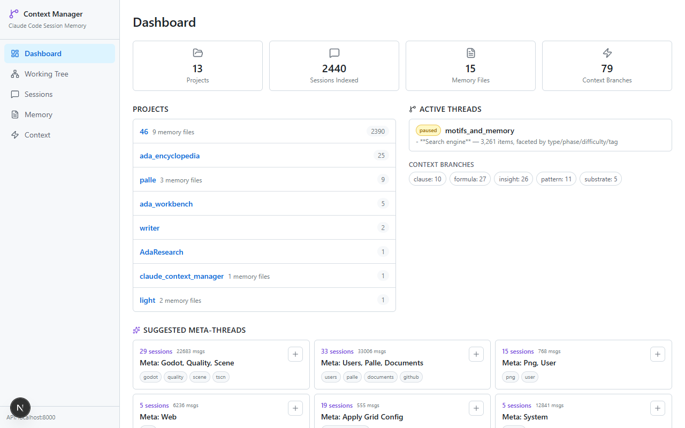
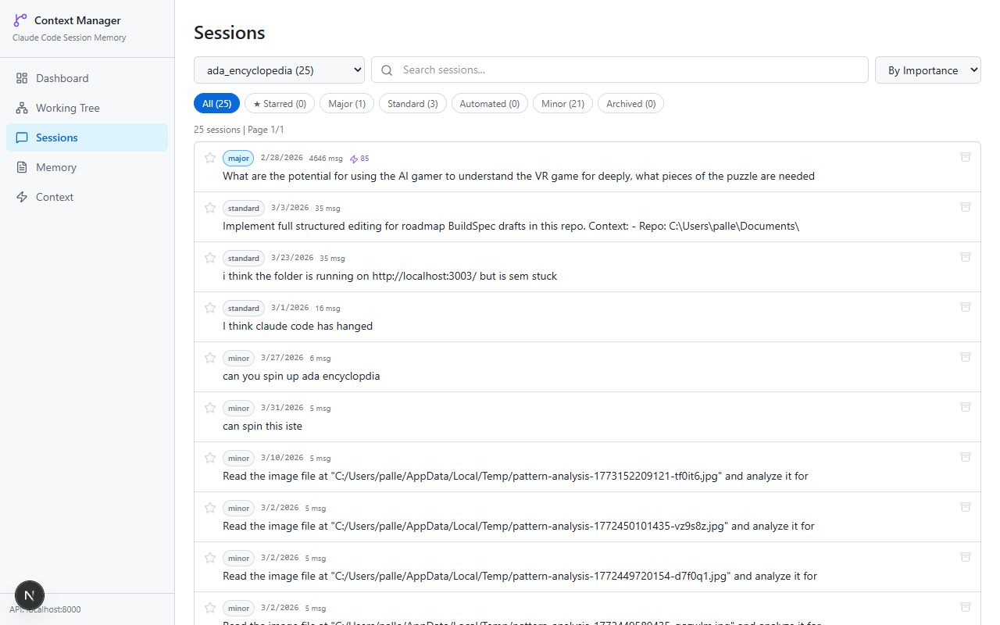

# Claude Context Manager

Browse, star, clone, and manage your Claude Code session history. Stop losing context between sessions.





## The Problem

Claude Code accumulates hundreds of conversations across projects. The built-in `--resume` shows recent sessions, but there's no way to:

- **Find** the session where you made that key decision
- **Triage** the 7 breakthrough sessions from 490 automated batch jobs
- **Clone** a conversation's context into a resumable thread file
- **Star** and **rate** important sessions so they surface first
- **Browse** memory files and context branches from a UI

### Why not just use `--resume`?

| | `--resume` | Context Manager |
|---|---|---|
| Find sessions | Lists recent by name | Search, filter, sort by importance/date/size |
| Cross-project | One project at a time | All projects in one dashboard |
| Triage | No classification | Auto: major/standard/minor/automated |
| Persistence | Ephemeral list | Star, rate, tag, archive |
| Resume context | Full transcript reload | Clone key decisions into lightweight thread file |
| Memory view | Read files manually | Web UI with temperature scoring |

## Example Workflow

```
1. Open the session browser at localhost:3001/sessions
2. Filter by "major" sessions, search for "migration"
3. Find the session where you debugged the database schema
4. Click "Clone" → creates thread_migration_fix.md with:
   - Key decisions made
   - Files touched
   - Turning points (pivots + breakthroughs)
   - Open questions
5. In a new Claude Code session:
   > "Read .claude/memory/thread_migration_fix.md and continue"
6. Claude picks up exactly where you left off
```

## What It Does

**Sessions** -- Browse all conversations with auto-classification (major/standard/minor/automated), importance scoring, star/archive/rate, custom titles, search, and filtering.

**Clone** -- Extract key decisions, files touched, turning points (plan changes and breakthroughs), and open questions from any session into a `thread_*.md` file that future sessions can resume from.

**Memory** -- View and edit project memory files (`MEMORY.md`, thread files) from a web UI. Temperature scoring (hot/warm/cold/frozen) surfaces what matters.

**Context Branches** -- Store working knowledge: formulas, proven rules (clauses), patterns, insights, and substrate definitions. Searchable by type, tag, and full text.

**Dashboard** -- Project overview with starred sessions, active threads, and context branch counts.

**Working Tree** -- Auto-generated project structure with manual overrides that survive regeneration.

## Quick Start

```bash
# 1. Clone
git clone https://github.com/palletorsson/claude-context-manager.git
cd claude-context-manager

# 2. Backend
cd backend
pip install -r requirements.txt
uvicorn main:app --port 8000

# 3. Frontend (new terminal)
cd frontend
npm install
npm run dev

# 4. Open http://localhost:3001
```

## Requirements

- **Python 3.10+** with pip
- **Node.js 18+** with npm
- **Claude Code** installed (`~/.claude` directory must exist with at least one project)

## Configuration

Copy `.env.example` to `.env` and adjust if needed:

```bash
CLAUDE_DIR=/home/user/.claude    # auto-detected as ~/.claude
BACKEND_PORT=8000                # default
NEXT_PUBLIC_API_URL=http://localhost:8000  # set in frontend/.env.local
```

Most users need zero configuration -- it auto-detects `~/.claude`.

## Architecture

See [ARCHITECTURE.md](ARCHITECTURE.md) for the full developer guide. Summary:

```
Backend (FastAPI, Python)          Frontend (Next.js, TypeScript)
  /api/projects                      /              Dashboard
  /api/sessions                      /sessions      Session browser
  /api/sessions/:id/messages         /sessions/:id  Detail + Clone
  /api/memory                        /memory        Memory editor
  /api/context                       /context       Context branches
  /api/clone                         /tree          Working tree
  /api/tree
  /api/dashboard
  /api/threads/suggest
```

**Data sources** (read-only, never modifies your Claude Code data):
- `~/.claude/projects/<project>/*.jsonl` -- session conversation logs
- `~/.claude/projects/<project>/memory/*.md` -- memory and thread files
- `~/.claude/sessions/*.json` -- active session metadata

**Cache** (`backend/data/cache.db`): session index, context branches, topic clusters, memory metadata. Safe to delete -- rebuilds on next startup.

## Testing

```bash
cd backend
python -m pytest tests/ -q    # 199 tests, ~2.4 seconds
```

## Features

### Auto-Classification

| Category | Criteria | Example |
|----------|----------|---------|
| **Major** | 200+ messages or 1MB+ | Deep work sessions, multi-hour debugging |
| **Standard** | 10-200 messages | Normal coding sessions |
| **Minor** | < 6 messages | Quick questions |
| **Automated** | Known batch prompt patterns | CI/CD runs, oversight jobs |

### Importance Scoring (0-100)

Computed from: message volume, user engagement, tool diversity, file operations, session size.

### Clone to Thread

Extracts from any session:
- First user message (the task)
- **Turning points** -- pivots (plan changes) and breakthroughs (root-cause discoveries)
- Key decisions made during the conversation
- Files touched (from Edit/Write/Read operations)
- Open questions
- Last assistant summary

Creates a `thread_*.md` in your project's memory directory.

### Memory Temperature

Memories are scored by recency, cross-session connectivity, and importance:
- **Hot** -- actively relevant, referenced recently
- **Warm** -- recently relevant, worth scanning
- **Cold** -- aging, review before relying on
- **Frozen** -- candidate for archival

### Context Branches

Five types of persistent knowledge:

| Type | Purpose | Example |
|------|---------|---------|
| `formula` | Equations, scales | Scoring algorithms, temperature formulas |
| `clause` | Proven rules | "Teleporter must be on void tile" |
| `pattern` | Working recipes | Artifact creation steps |
| `insight` | Discoveries | "Tiles repeat, mosaics don't" |
| `substrate` | Material definitions | Shader properties |

## API Documentation

Start the backend and visit `http://localhost:8000/docs` for interactive Swagger UI.

## Contributing

See [CONTRIBUTING.md](CONTRIBUTING.md) for setup, conventions, and PR expectations. Issues and PRs welcome.

## License

MIT
